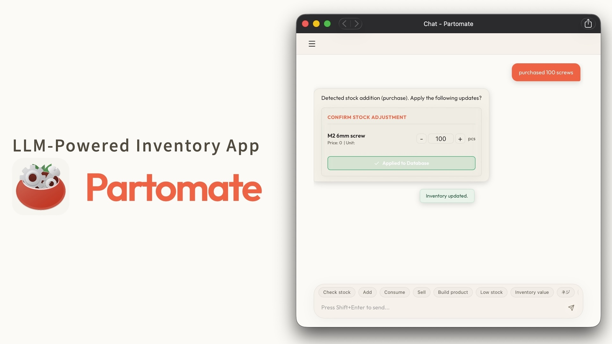
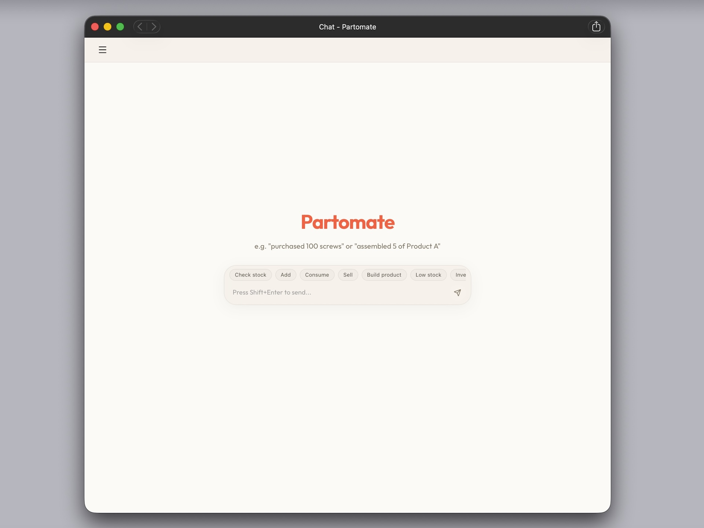
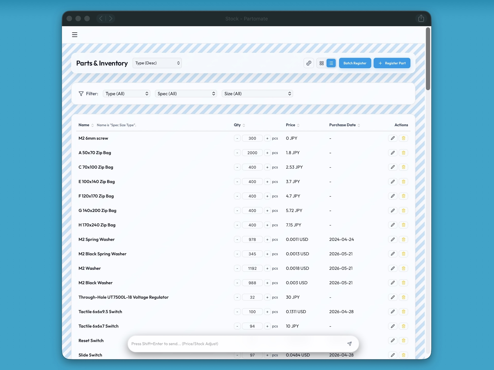
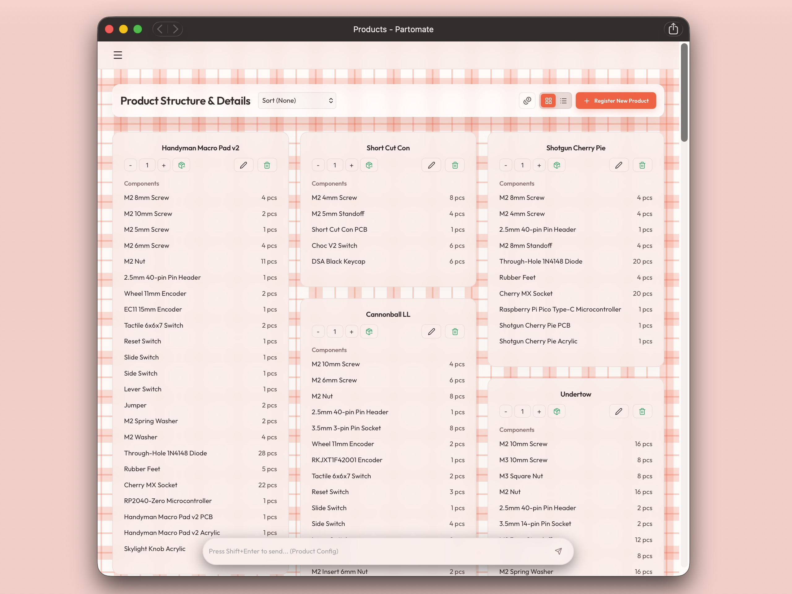
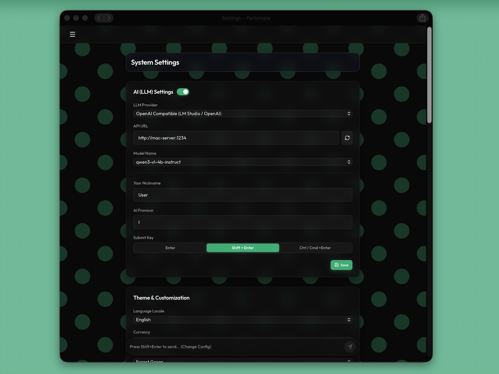

# Partomate ([日本語](README_JP.md))

Partomate is a web application for managing parts, inventory, and product compositions.
It lets you track part quantities, categories, unit prices, purchase dates, and low-stock thresholds, as well as review the parts used in each product and their estimated cost.

With the AI chat feature, you can describe inventory additions, inventory consumption, and product composition changes in natural language.
AI-proposed changes are applied to the database only after the user approves them.







## Key Features

- Create, edit, and delete parts in inventory
- Organize parts using three-level categories
- Manage quantities with decimal values
- Review low-stock thresholds and total inventory value
- Define product compositions and calculate costs
- Consume component inventory when assembling products
- Integrate AI chat through OpenAI-compatible APIs or Ollama
- Connect external LLM clients through the MCP server

## Installing with Docker

### Requirements

- Docker Desktop or Docker Engine
- Docker Compose

### Starting the Application

Copy `.env.example` to `.env` and set `SECRET_KEY` to a random value. `SECRET_KEY` is required; if it is not set, `docker compose` will stop with an error during startup.

```bash
cp .env.example .env
# Set SECRET_KEY in .env (for example, use the output of: openssl rand -hex 32)
docker compose up --build
```

After the application starts, open the following URL in your browser:

```text
http://localhost:15173
```

The API is available at:

```text
http://localhost:18000
```

If ports `18000` or `15173` are already in use by another application, you can change them in `.env`:

```env
FRONTEND_PORT=5173
BACKEND_PORT=8000
```

### Data Storage

The Docker version stores the database and uploaded files in the host-side `data/` directory:

```text
data/
  partomate.db
  partomate.db-shm
  partomate.db-wal
  uploads/
```

As long as you keep the `data/` directory, your inventory, products, and settings will remain intact even if you recreate the containers or images.
To back up your data or migrate to another computer, copy the `data/` directory first.

## Initial Setup

The administrator registration screen appears the first time you access the application.
After creating the administrator account, you can log in and start managing your inventory.

Partomate is designed as a self-hosted application operated by a single administrator. After the initial registration, there are no features for registering or managing additional users.

When the database is empty, the following sample data is added automatically:

- `M2 6 mm screw`: 100 pieces
- `M2 nut`: 100 pieces
- `Pro Micro microcontroller`: 1 piece
- `Lead-type 1N4148 diode`: 9 pieces
- `Rubber foot`: 4 pieces
- `Product A`: A sample product made from the parts listed above

Sample data is not added if the database already contains any parts or products.

## If You Forget the Administrator Password

There is no password reset feature. If you forget the administrator password, empty the `users` table in the database. This re-enables the initial registration screen so that you can register a new administrator.

Emptying the `users` table does not delete inventory, product compositions, settings, or other application data.

Before proceeding, stop the application or container and back up the `data/` directory as a precaution.

When using Docker with `./data/partomate.db` mounted as a volume:

```bash
sqlite3 ./data/partomate.db "DELETE FROM users;"
```

For local development with `backend/partomate.db`:

```bash
sqlite3 backend/partomate.db "DELETE FROM users;"
```

Restart the application after running the command. The initial registration screen will appear when you open the application in your browser.

## AI Features

The AI features connect to an external LLM server, such as an OpenAI-compatible API or Ollama.
Partomate does not include an AI model or Ollama.

You can configure the following options on the Settings page:

- LLM provider
- API URL
- Model name
- OpenAI-compatible API key
- System prompt

## Running in Development

Backend:

`SECRET_KEY` is required for signing JWTs. The backend will stop with an error at startup if it is not set, so set it to a random value for development.

```bash
cd backend
source venv/bin/activate
export SECRET_KEY=$(openssl rand -hex 32)
uvicorn app.main:app --reload --port 18000
```

Frontend:

```bash
cd frontend
npm run dev
```

Open `http://localhost:15173` in your browser.

The default database for local development is `backend/partomate.db`.
The Docker version uses `data/partomate.db` through `DATABASE_URL`.

## Verification

Backend:

```bash
cd backend
python -m pytest test_api.py
```

Frontend:

```bash
cd frontend
npm run build
```

## Related Documentation

- Specification: [docs/spec.md](docs/spec.md)
- Development notes: [docs/development.md](docs/development.md)
- Distribution policy: [docs/deployment.md](docs/deployment.md)
- MCP connection: [README_MCP.md](README_MCP.md)
