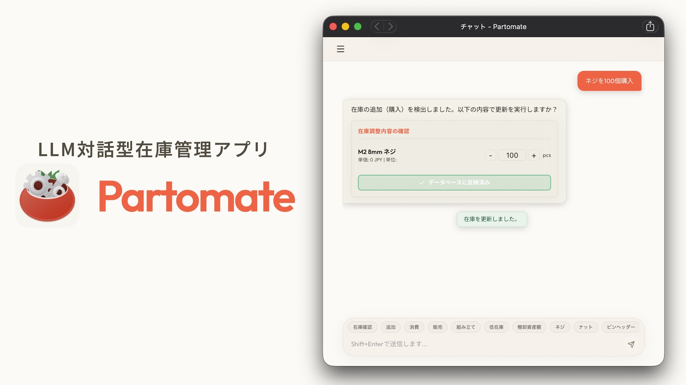
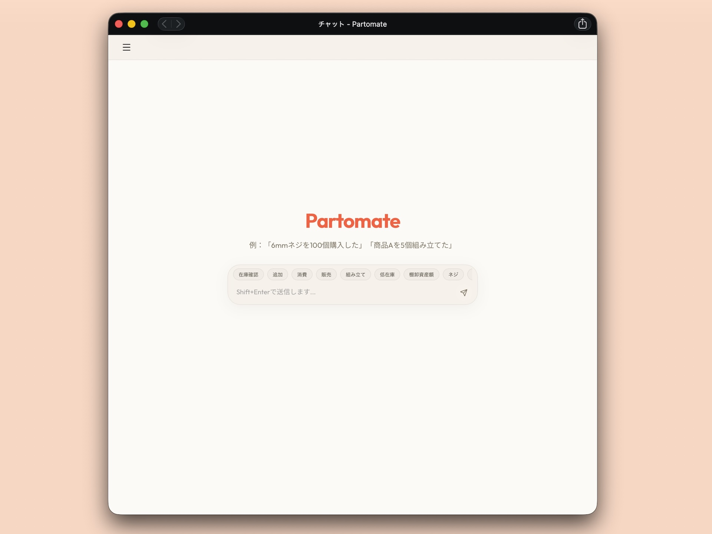
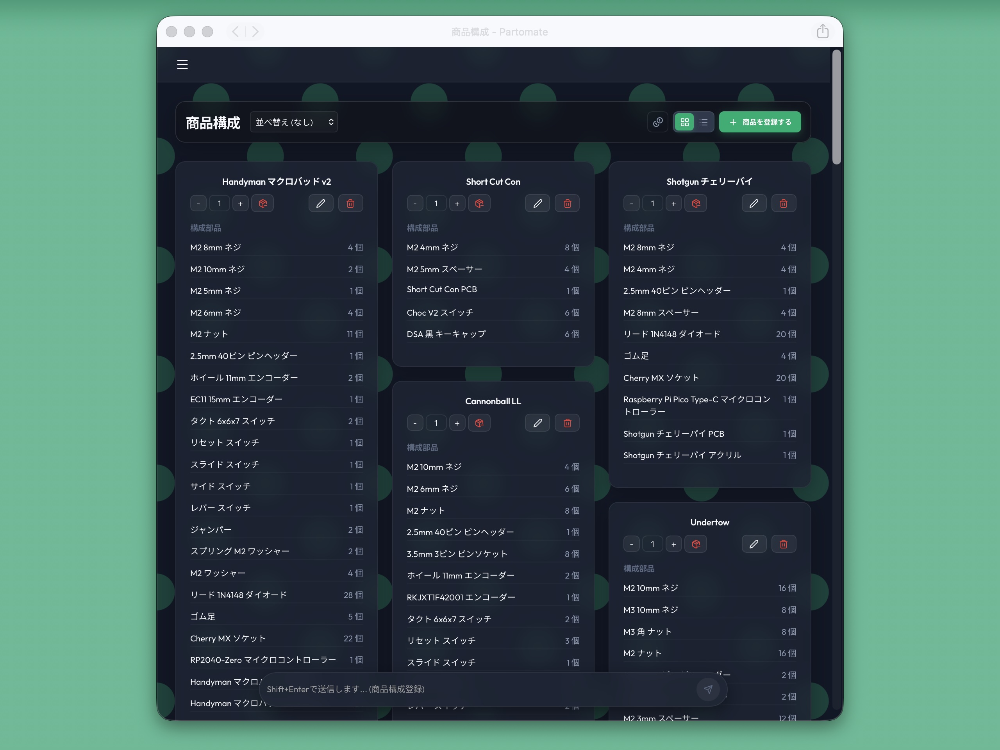
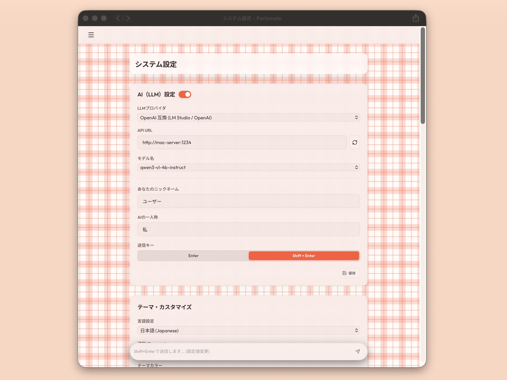

# Partomate（[English](README.md)）

Partomate は、部品・在庫・商品構成を管理するためのWebアプリケーションです。
部品の数量、カテゴリ、単価、購入日、低在庫しきい値を記録し、商品ごとの構成部品や概算原価を確認できます。

AIチャット機能を使うと、在庫の追加・消費や商品構成の変更案を自然文から作成できます。
AIが提案した変更は、ユーザーが承認した場合だけデータベースへ反映されます。







## 主な機能

- 部品在庫の登録、編集、削除
- 3階層カテゴリによる部品整理
- 小数を含む数量管理
- 低在庫しきい値と棚卸資産額の確認
- 商品構成の登録と原価計算
- 商品組み立てによる構成部品の在庫消費
- OpenAI互換API / Ollama によるAIチャット連携
- MCPサーバーによる外部LLMクライアント連携

## Docker版のインストール方法


### 必要なもの

- Docker Desktop または Docker Engine
- Docker Compose

### 起動

`.env.example` を `.env` にコピーし、`SECRET_KEY` に任意のランダム値を設定します。`SECRET_KEY` は必須で、未設定のままだと `docker compose` は起動時にエラーで停止します。

```bash
cp .env.example .env
# .env に SECRET_KEY を設定（例: openssl rand -hex 32 の出力）
docker compose up --build
```

起動後、ブラウザで以下を開きます。

```text
http://localhost:15173
```

APIは以下で公開されます。

```text
http://localhost:18000
```

既に `18000` 番や `15173` 番を別のアプリが使っている場合は、`.env` でポートを変更できます。

```env
FRONTEND_PORT=5173
BACKEND_PORT=8000
```

### データ保存場所

Docker版では、DBとアップロードファイルをホスト側の `data/` に保存します。

```text
data/
  partomate.db
  partomate.db-shm
  partomate.db-wal
  uploads/
```

`data/` を残しておけば、コンテナやイメージを作り直しても在庫・商品・設定データは残ります。
バックアップや別PCへの移行では、まず `data/` ディレクトリをコピーしてください。

## 初回セットアップ

初回アクセス時は管理者ユーザーの登録画面が表示されます。
管理者ユーザーを作成すると、ログインして在庫管理を始められます。

本アプリはセルフホスト型の単一管理者運用を前提としており、初回登録後は追加のユーザー登録・管理機能はありません。

DBが空の場合、以下のサンプルデータが自動投入されます。

- `M2 6mm ネジ`: 100個
- `M2 ナット`: 100個
- `Pro Micro マイクロコントローラー`: 1個
- `リードタイプ 1N4148 ダイオード`: 9個
- `ゴム足`: 4個
- `商品A`: 上記部品を使うサンプル商品

既に部品または商品が存在するDBでは、サンプルデータは投入されません。

## 管理者パスワードを忘れた場合

パスワードのリセット機能はありません。管理者パスワードを忘れた場合は、DBの `users` テーブルを空にすると初回登録画面が再度有効になり、新しい管理者を登録し直せます。

`users` テーブルを空にしても、在庫（部品）・商品構成・設定などのデータは削除されません。

作業前にアプリ（またはコンテナ）を停止し、念のため `data/` をバックアップしてから実行してください。

Docker運用時（`./data/partomate.db` をボリュームマウントしている場合）:

```bash
sqlite3 ./data/partomate.db "DELETE FROM users;"
```

ローカル開発時（`backend/partomate.db`）:

```bash
sqlite3 backend/partomate.db "DELETE FROM users;"
```

実行後にアプリを再起動し、ブラウザでアクセスすると初回登録画面が表示されます。

## AI機能

AI機能はOpenAI互換APIまたはOllamaなどの外部LLMサーバーに接続して使います。
モデル本体やOllamaはPartomateには同梱していません。

設定画面から以下を指定できます。

- LLMプロバイダ
- API URL
- モデル名
- OpenAI互換APIキー
- システムプロンプト

## 開発用起動

バックエンド:

`SECRET_KEY` はJWT署名に必須です。未設定のままだと起動時にエラーで停止するため、開発時は任意のランダム値を設定します。

```bash
cd backend
source venv/bin/activate
export SECRET_KEY=$(openssl rand -hex 32)
uvicorn app.main:app --reload --port 18000
```

フロントエンド:

```bash
cd frontend
npm run dev
```

ブラウザで `http://localhost:15173` を開きます。

開発時の既定DBは `backend/partomate.db` です。
Docker版では `DATABASE_URL` により `data/partomate.db` を使います。

## 検証

バックエンド:

```bash
cd backend
python -m pytest test_api.py
```

フロントエンド:

```bash
cd frontend
npm run build
```

## 関連ドキュメント

- 仕様: [docs/spec.md](docs/spec.md)
- 開発メモ: [docs/development.md](docs/development.md)
- 配布方針: [docs/deployment.md](docs/deployment.md)
- MCP接続: [README_MCP.md](README_MCP.md)
